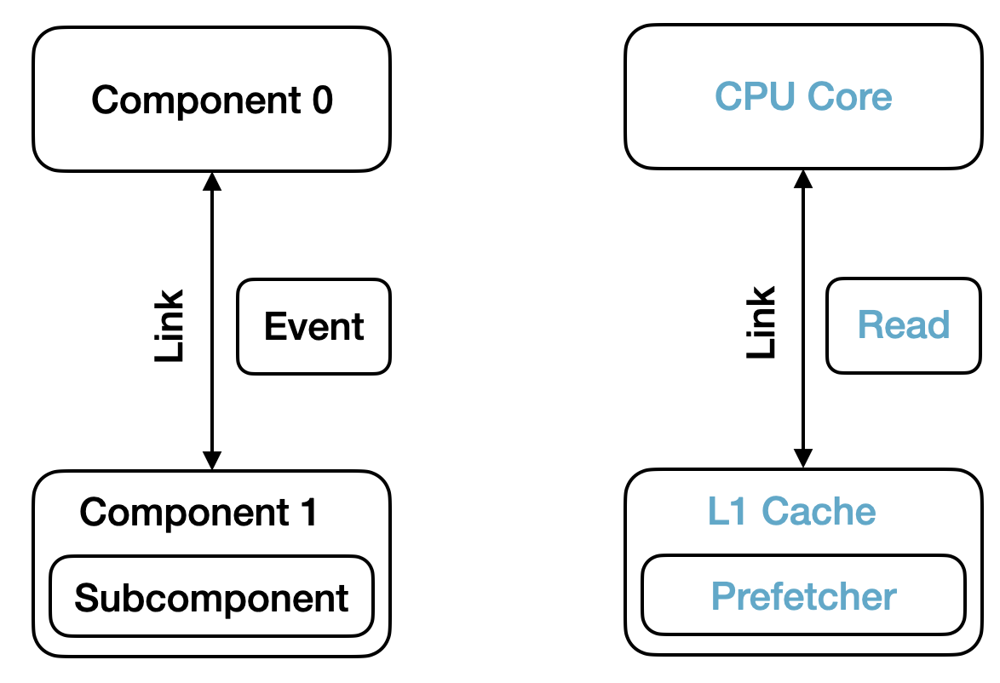
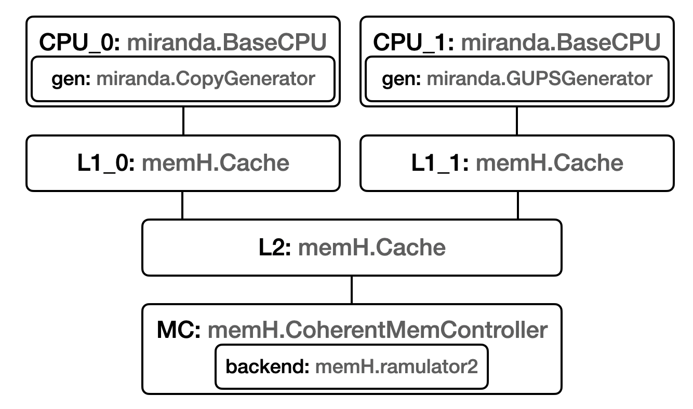

# Summary
Designing and manufacturing a new computer system is a costly and time-consuming endeavor. While this has long been the case, manufacturing costs have been rising exponentially in recent years, with some estimating that Apple may have spent $1 billion on just the tape-out of their latest generation chips, the M3 line [@apple]. Similarly, the contract for the fastest supercomputer in the world, Lawrence Livermore National Laboratory's El Capitan, was reportedly worth $600 million [@axios]. Given these high costs, an important step in the design of new computer systems is simulation, where computer architects can evaluate new ideas without needing to physically construct new systems.

The Structural Simulation Toolkit (SST) is used to create such simulations; it can be used for everything from detailed, register-level simulation all the way up to simulating entire supercomputers. SST stands out from other computer architecture simulators by offering a scalable and extensible foundation, alongside a modular and diverse collection of components.

# Statement of need
Computer architects have created simulators to evaluate all parts of computer systems, including processors, networks, memory, storage, and more.  However, these simulators rarely play together well. Even when someone takes the time to make a connection, it is likely to be a short-lived, unmaintained project containing unstated assumptions that future users may be unaware of. Furthermore, someone wishing to create their own simulator likely does not want to spend time writing and debugging parallel code on top of developing their models in order to make them scalable. SST addresses both of these problems by providing the building blocks that allow developers to rapidly compose novel simulators on top of a scalable core.

# SST Structure
SST is made up of two main repositories, SST-Core and SST-Elements. SST-Core contains the basic building blocks of a simulation, like clocks and links, whereas SST-Elements contains actual simulation models such as processors, caches, and routers built on top of the core. We will cover some basic SST Terminology before discussing the features that make SST a state-of-the-art computer architecture simulation framework.

## SST Terminology
In SST, a simulation is made of *components*. A component is some logical piece of a computer, like a processor or a cache. Components communicate by sending *events* across *links*.  The behavior of components can be extended with *subcomponents* and *modules*. As an example, a processor component may send a memory request to a cache component by creating an event and sending it across the cache link. Once the cache has received and processed the event, it will create and send a new event back to the processor with the requested data. The cache may contain a subcomponent such as a prefetcher, which can easily be changed to test new prefetching strategies. This is depicted in \autoref{fig:basics}. As we will see in the next section, this modularity is a key feature in SST.

{ width=60% }

SST is a parallel discrete-event simulator. As SST requires that all components communicate only using links, the core is able to run different components in different threads or in different processes. To maintain a correct parallel simulation, SST uses a conservative synchronization algorithm; this means that using knowledge on the minimum latency of the links between components, the core knows how far ahead (in simulated time) each component is allowed to run before needing to pause and ensure all connected components are caught up [@conservativesync]. This is all done in SST-Core, meaning users creating new simulation models do not need to worry about parallelizing their code.

## State of the Art Features in SST-Core

While SST-Core is not itself a simulator, but rather a framework for building simulators, we discuss here some key features that help it stand out from other tools; namely: modularity and scalability.

### Modularity
Modularity is a first-order concern in SST, supporting not just the extension and interoperability of simulation components, but also customization of SST-Core itself. Modules in the core use well-defined interfaces, called third-party APIs, meaning users of the codebase can easily extend or replace the default implementations. We consider a few of these APIs here:

 * Partitioner: SST-Core, being a parallel program, must consider how different simulation components are placed on different ranks when running in parallel. Users wishing to replace the default partitioner can do so by implementing the partitioner API.

 * TimeVortex: The TimeVortex manages event ordering and delivery. While most users will never want or need to make changes so deep in the code, SST's modularity makes this possible.

 * Statistics: SST includes support for recording statistics using different data structures, such as accumulators or histograms. Support is also available for different output formats including text files and CSVs. Both of these interfaces can be extended, as exemplified by the work that Tactical Computing Labs did to add SQLite support without changing any code in SST-Core [@sst-data].

 * AttachPoints: AttachPoints cannot be used by themselves, but they serve as building blocks for features like *PortModules*, which allow for the inspection of events as they enter or exit a component, and *ProfilePoints*, which insert timing hooks to debug performance issues with simulations. The generic nature of AttachPoints make them useful for many applications.

#### The ELI
The secret sauce behind SST's extensibility is the element library information, or ELI. The ELI allows users that develop new components to *register* them with the Core and load them at runtime. This doesn't include just new simulation components like a new memory simulator - this includes the above mentioned modules as well. This means you can implement your new module, be it a new simulation component or an implementation of a third-party API, and load it at runtime without needing to edit the Core codebase at all.

### Scalability
The other SOTA features of SST fall into the scalability category. SST runs simulations in parallel with support for both *multithreaded* execution as well as *multiprocess* execution using MPI. Beyond just parallel execution, SST includes support for important features enabling large-scale execution:

* Checkpointing: Starting with SST 14.0, SST has support for checkpointing simulations, allowing users to perform long running simulations across many nodes without fear of losing their work if a node fails and the job has to be stopped.

* Interactive Debugging: Piggy-backing on the serialization work that was done to support checkpointing, SST has experimental support for an interactive debug mode, allowing users to pause the simulation and inspect or change values in components. The ability to debug large-scale runs is crucial to continuing to scale SST to larger and larger runs.

# SST-Elements
SST-Elements contains many simulation components, from CPU and GPU models to network models. In SST lingo, *elements* are anything with ELI, such as components, subcomponents, and modules. An *element library* is a collection of related elements. While there isn't space here to cover each element library in detail, this section will cover some example simulations a user might build with SST-Elements so that we can understand the breadth of models supported by SST.

## Chip-level Simulations
At the heart of any computing system is some type of processor, such as a CPU or a GPU, so SST-Elements provides a number of elements that serve this purpose. There are several trace-based simulation components for users primarily wishing to study the memory system. If a user wants to simulate a simple memory access pattern, `Miranda` can generate it. If a user wants to capture a memory trace from a real program, `Ariel` supports this. However, if users want to study detailed microarchitectural features such as pipelining or superscalar execution, `Vanadis` provides an out-of-order core model that supports the MIPS and RISC-V instruction sets. Finally, if you want a GPU, then the `Balar` element library is what you need, which integrates the popular `Accel-Sim` simulator [@accelsim].

All of these processors are not complete without a memory system, which is what `memHierarchy` is for, and no memory system is complete without a DRAM simulator. Those wanting a simple DRAM model can use the ones included in SST-Elements, and those needing maximum accuracy can use one of the state of the art DRAM simulators integrated with SST, such as `Ramulator 2` [@ramulator2].

In \autoref{fig:miranda}, we can see an example of a simulation that has 2 `miranda` cores, each with an L1 cache, connected to a shared L2 and a DRAM simulator. 

{ width=60% }

## Network Simulations
In addition to single-node simulations, SST is often used for network simulations, a key component in supercomputers. It is useful to think of a network simulation consisting of two parts: (1) a traffic generator, such as an MPI program, and (2) a network simulator that simulates the time it takes for packets to move between nodes. To generate traffic, users with a simple problem in mind may use `Ember` to quickly simulate MPI calls using a state-machine representation. Users wanting something more like direct execution may opt for `Mercury`, which can simulate entire MPI programs using lightweight threads and a sekelonization process.

To actually simulate the data moving around in a network, `Kingsley` or `Merlin` can be used. `Kingsley` is best suited for 2D-grid networks such as those in a NoC, while `Merlin` is much more general and can be used for simulating anything from a NoC to a complex supercomputer network. 

# Related Work

Many simulators exist at different levels of detail in the field of computer architecture. We first consider a few similar projects, and then we discuss a few projects that are already integrated into the SST ecosystem. We will only consider open-source simulators here, although proprietary simulators exist as well.

## Other Computer Architecture Simulators

Here are some related simulators:

 * gem5 is a single-threaded, full-system simulator [@gem5]. Full system means it can boot an operating system, which is a feature not supported by SST's processor models. It includes models for many modern CPUs. It also includes the network-on-chip simulator HeteroGarnet, similar to SST's Kingsley and Merlin simulators [@heterogarnet].

 * Sniper is a parallel, multicore x86 CPU simulator with multi core models, allowing users to trade off accuracy and simulation speed [@sniper]. The most recent updates to Sniper are described in the Pac-Sim paper, which speeds up simulation using sampling [@pacsim],

 * ns-3 is a detailed network simulator, similar to SST's Merlin [@ns3].

 * ROSS is a PDES framework [@ross] that uses an optimistic algorithm, in contrast to SST which is conservative. Components are allowed to simulate further in the future, but must be able to roll back events if an event arrives that occurred in the past. The CODES project builds on top of ROSS to model exascale computing systems, focusing largely on modeling the network [@codes].

 * ASTRA-sim, is framework for representing machine learning workloads and facilitating design space exploration of new AI/ML-focused machines [@astra].

## Integrated Simulators

Due to the extensible nature of SST and the stable nature of SST-Core, users are able to maintain their simulators externally. A longer list of projects is available on the [SST Website](http://sst-simulator.org/sst-docs/docs/community), but a few of the most popular compatible projects are:

 * Rev, an out-of-order RISC-V CPU simulator [@rev]

 * STONNE, a cycle-level simulator for modeling neural network inference accelerators [@stonne]

 * SimEng, a simulator framework for modeling ARM and RISC-V out-of-order processors [@simeng]

 * Ramulator 2, a DRAM simulator with models for modern technologies such as HBM [@ramulator2]

 * Accel-Sim, a CUDA GPU simulator [@accelsim]

## Ongoing Research

SST is used by many researchers around the world, as evidenced by the many projects that have been integrated with it and the long list of contributors on GitHub (SST-Elements has 57 contributors at time of writing). Some research that we are aware of are (1) efforts to model modern CPU memory hierarchies such as those in AMD and Intel processors, (2) efforts to design modern supercomputer network topologies like PolarFly [@polarstar], and (3) work on enhancing the checkpoint-restart capabilities to allow for different numbers of ranks to be used on restart.

# Further Reading

While there wasn't space to cover every detail of SST here, the SST Team have documented the project in detail on the SST Docs website, located at [http://sst-simulator.org/sst-docs/](http://sst-simulator.org/sst-docs/). This website covers the technical details of SST-Core, as well as all of the simulation components available in SST-Elements. Furthermore, the team has run a number of tutorials, which are all available on the SST Github at this link: [https://github.com/sstsimulator/sst-tutorials/tree/master](https://github.com/sstsimulator/sst-tutorials).

# Acknowledgements

SST is a long running project, with contributors that have come and gone and projects that have been subsumed into the whole. The authors would like to thank Helgi Adalsteinsson, Amro Awad, Brian Barrett, John van Dyke, Si Hammond, Gilbert Hendry, Curtis Janssen, Mike Levenhagen, Aaron Levine, Branden Moore, and Jereme Wilke for the work they did that has made SST what it is today. We would also like to thank Tactical Computing Labs and Cornelis Networks for their collaborative efforts and contributions to SST.

This article has been authored by an employee of National Technology & Engineering Solutions of Sandia, LLC under Contract No. DE-NA0003525 with the U.S. Department of Energy (DOE). The employee owns all right, title and interest in and to the article and is solely responsible for its contents. The United States Government retains and the publisher, by accepting the article for publication, acknowledges that the United States Government retains a non-exclusive, paid up, irrevocable, world-wide license to publish or reproduce the published form of this article or allow others to do so, for United States Government purposes. The DOE will provide public access to these results of federally sponsored research in accordance with the DOE Public Access Plan https://www.energy.gov/downloads/doe-public-access-plan.

